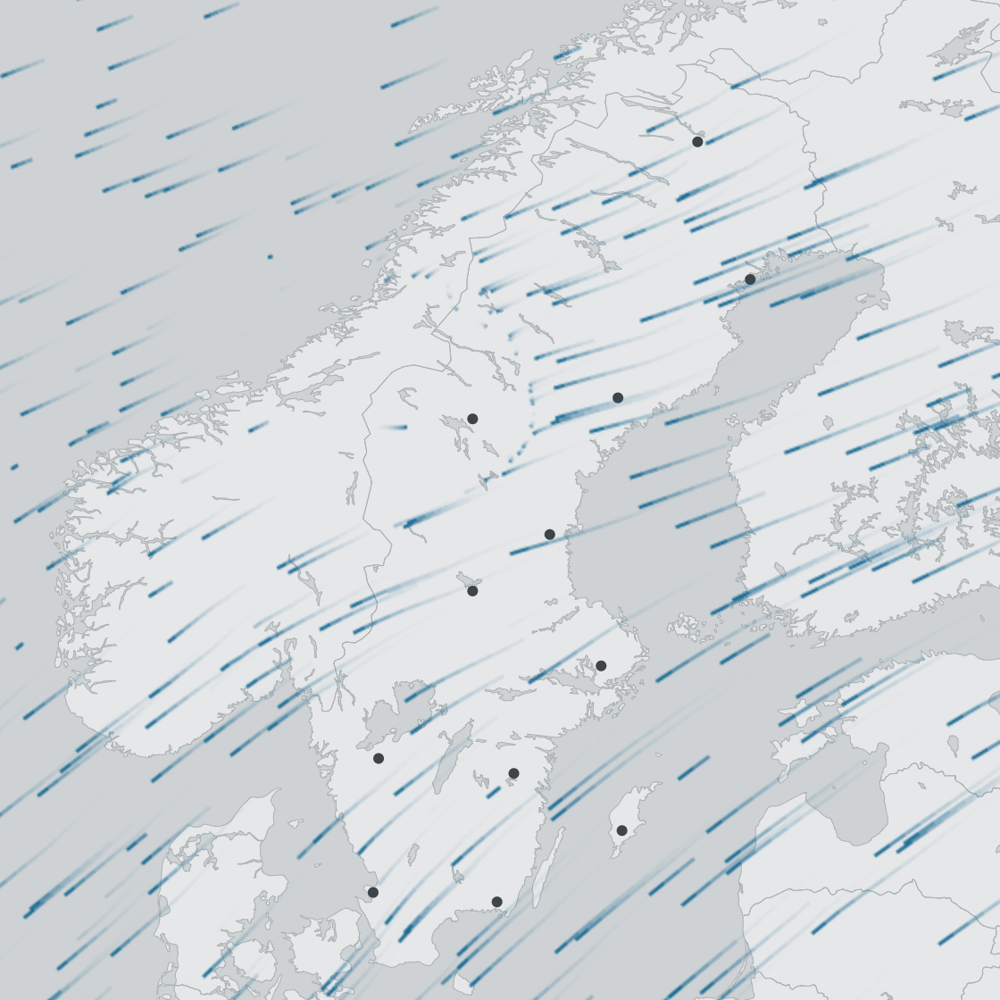

--- 
title: "Process vertical profile data for visualizations"
author: "Peter Desmet"
date: "`r Sys.Date()`"
site: bookdown::bookdown_site
output:
  bookdown::gitbook:
    split_by: chapter
    config:
      edit: https://github.com/enram/timamp-etl/blob/master/src/%s
      search: no
      sharing:
        facebook: no
        twitter: yes
        all: []
github-repo: enram/timamp-etl
---

# Preface {-}

This document describes how we process **vertical profile (vp) data**[^1] for the visualizations [bird migration flow visualization](http://enram.github.io/bird-migration-flow-visualization/viz/) and [TIMAMP](http://timamp.github.io/). You can also use it to just download or extract vp data for further analysis.

[^1]: Vertical profiles of birds generated from weather radar volume scans by [vol2bird](https://github.com/adokter/vol2bird).

