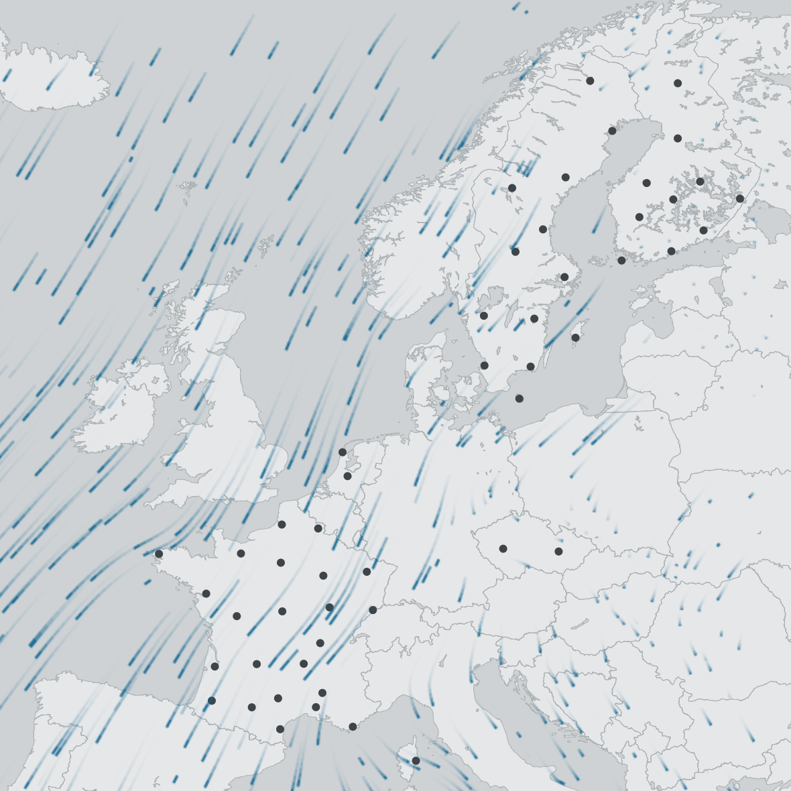

--- 
title: "Vertical profile (vp) data processing for analyses and visualizations"
author: "Peter Desmet"
date: "`r Sys.Date()`"
site: bookdown::bookdown_site
output:
  bookdown::gitbook:
    split_by: chapter
    config:
      edit: https://github.com/enram/vp-processing/blob/master/src/%s
      search: no
      sharing:
        facebook: no
        twitter: yes
        all: []
github-repo: enram/vp-processing
---

# Preface {-}

This document describes how we process **vertical profile (vp) data**[^1] for further analysis and visualizations such as [bird migration flow visualization](http://enram.github.io/bird-migration-flow-visualization/viz/) and [TIMAMP](http://timamp.github.io/).

[^1]: Vertical profiles of birds generated from weather radar volume scans by [vol2bird](https://github.com/adokter/vol2bird).



<!--chapter:end:index.Rmd-->

# Get started {#setup}

```{r setup_rmd_settings, include = FALSE}
knitr::opts_chunk$set(echo = TRUE, warning = FALSE, message = FALSE)
```

This chapter explains how to get you up and running. It assumes you are working in RStudio.

## Install packages

First, you will need to install a number of R packages we will use:

```{r setup_install_packages, eval = FALSE}
install.packages(c(
  "devtools",  # To install packages from GitHub
  "yaml",      # To read processing settings
  "dplyr",     # To process dataframes
  "loopr",     # To process dataframes with loops
  "lubridate", # To process dates
  "bookdown"   # To generate this documentation
))
```

```{r setup_install_bioRad, eval = FALSE}
devtools::install_github("enram/bioRad", ref="master") # To process vp data
```

## Download code

To run or adapt the code in this document, fork or clone this repository: https://github.com/enram/vp-processing.

## Define processing settings {#settings}

The processing requires a number of settings we need to define. If you want to [run the processing with other data and settings](#own-processing), then **this is the only code you need to update** (in `setup.Rmd`):

```{r setup_define_settings}
# The following paths are relative to this script (i.e. to the src directory)

# Where you store your raw data (needs a trailing slash)
raw_data_dir <- "../data/raw/all_flyway/"
# Where it should write the processed data (needs a trailing slash).
processed_data_dir <- "../data/processed/flyway/" # Make sure this folder exists!
# Your processing settings:
settings_file <- "../settings/flyway_test.yml"
# The radar metadata (incl. coordinates):
radars_metadata_file <- "../settings/radars.csv"
```

## Run processing

The processing of the vp data is done in several steps. Each has its own chapter and [`Rmd file`](https://github.com/enram/vp-processing/tree/master/src):

1. [Get started](setup.html) (`setup.Rmd`) = this chapter
2. [Extract vp data and process for further analyses](extract-vp.html) (`extract_vp.Rmd`)
3. [Process vp data for the Bird migration flow visualization](vp-to-flowviz.html) (`vp_to_flowviz.Rmd`)
4. [Process vp data for TIMAMP](vp-to-timamp.html) (`vp_to_timamp.Rmd`)

_Step 3 and 4 are currently not yet implemented._

The repository comes with [example settings](https://github.com/enram/vp-processing/tree/master/settings) and [data](https://github.com/enram/vp-processing/tree/master/data) for all steps, so you can run the processing out of the box:

1. Go the `src` directory of the downloaded code
2. Open `vp-processing.Rproj` in RStudio

### Run all steps

To run all steps use the build functionality: it will run all the `.Rmd` files in `src` and generate [fancy documentation](#update-documentation):

1. Click on the `Build` pane in RStudio
2. Click the `Build book` button
3. Wait for the build to finish

If you used example data, nothing should have changed: you've just reprocessed those files.

### Run individual steps

If you are adapting the code, it can be useful to run individual steps. Except for `setup.Rmd`, all steps read input data file(s) and generate output data file(s). If those data files are already there, you don't need to rerun the step that generated those. However, all files use the [processing settings](#settings) defined in `setup.Rmd`, so you need to run that file at least once first:

1. Open and run `setup.Rmd` in RStudio
2. Open and run one of the other `.Rmd` files
3. Adapt the `.Rmd` file and run to test

## Run your own processing {#own-processing}

If you want to run the processing with your own data and processing settings, do this:

### Upload your data

1. Add a new directory to `data/raw` and give it a meaningful name
2. Update `raw_data_dir` in \@ref(settings) so the code can find your directory
2. Copy your vp data to that directory or download vp data from the [ENRAM bird profile data repository](http://enram.github.io/data-repository)

To download data, adapt the following to your needs and run it. You might want to get some ☕ as this could take a while:

```{r setup_download_data, results="hide", eval=FALSE}
library(bioRad)
bioRad::download_vp(
  start_date = "2017-03-01",
  end_date = "2017-03-01",
  country = c("se"),
  radar = c("ang", "arl"),
  localpath = "../data/raw/my_data"
)
```

### Update settings

1. Copy and paste `example_settings.yaml` in `settings` and give it a meaningful name
2. Update `settings_file` in \@ref(settings) so the code can find your file
3. Adapt your settings file to your own needs

### Update radars metadata

1. Copy and paste `example_radars.csv` in `settings` and give it a meaningful name
2. Update `radars_file` in \@ref(settings) so the code can find your file
3. Adapt your settings file to your own needs

Once done, [run all steps of the processing](#run-all-steps). There should be no need to adapt the code.

## Update code

If the processing doesn't fit your needs, you can update the code by editing the relevant file in `src` and running it (see \@ref(run-individual-steps)). If you encounter a bug in the original code, please let us know by [filing an issue](https://github.com/enram/vp-processing/issues/new) or submitting a pull request.

## Update documentation

What your are reading here (in your browser) is in fact all generated from the `.Rmd` files in the `src` directory, using the R package [bookdown](https://bookdown.org/yihui/bookdown/).

If you notice a typo in this documentation, you can correct it by clicking the pencil icon in the menu at the top, which will take you straight to the correct `.Rmd` file in the [original repository on GitHub](https://github.com/enram/vp-processing). If you click the pencil icon on that GitHub page, you will be able to edit right away or create a copy (a fork) of the repository to do so, depending on your access rights.

If you want to generate your own fancy documentation 📕 from the adapted `.Rmd` files, then just [run all steps](#run-all-steps). The build process will create your documentation in the `docs` repository. Open `index.html` in your browser to see it.

For more info on debugging or hosting your documentation (i.e. on GitHub pages), see [this bookdown book on bookdown](https://bookdown.org/yihui/bookdown/). 😊

<!--chapter:end:setup.Rmd-->

# Extract vp data {#extract-vp}

```{r extract_rmd_settings, include = FALSE}
knitr::opts_chunk$set(echo = TRUE, warning = FALSE, message = FALSE)
```

In this chapter we'll select, read, combine, filter and export data from vp files to a single, unaggregated CSV file.

```{r extract_load_libraries, results = "hide"}
library(bioRad)
library(dplyr)
library(loopr)
library(lubridate)
source("functions/vp_to_df.R")
source("functions/load_settings.R")
```

## Load settings

All of the filtering options we'll use here are defined in **yaml settings file**, which we pointed to in `setup.Rmd` (see \@ref(settings)). Let's load those:

```{r extract_load_settings}
settings <- load_settings(settings_file, radars_metadata_file)
```

Found **`r length(settings$general$radar_ids_5char)` radars from `r length(settings$general$countries)` countries** in the settings.

## Select date range & radars

Select vp files on the date range and radars we defined in our settings (_file selection_):

```{r extract_get_file_paths}
vp_file_paths <- bioRad::retrieve_vp_paths(
  start_date = settings$general$start_date,
  end_date = settings$general$end_date,
  radar = settings$general$radar_ids_3char,
  path = raw_data_dir
)
```

The file paths we get back only start from the data directory, so we need to append those with the path to the data directory itself:

```{r extract_complete_file_paths}
vp_file_paths <- paste0(raw_data_dir, vp_file_paths)
```

There are **`r length(vp_file_paths)` vp files** that meet our criteria. Preview:

```{r extract_preview_file_paths}
head(vp_file_paths, 5)
```

## Read vp files

We read all those files with bioRad. This could take a while (☕ or 🛌 time):

```{r extract_read_vp_data_take_a_break}
vp_files <- bioRad::readvp.list(vp_file_paths)
```

## Select variables

A single vp file contains a data frame with heights as rows and variables as columns:

```{r extract_show_vp_data_structure}
str(vp_files[[1]]$data)
```

We only need a couple of variables (`HGHT`, `u`, `v`, `dens`, `dd`, `ff`) and attributes (`date_time` and `radar_id`) from the vp_files (_column selection_). We retrieve those with the custom function `vp_to_df()` after which we combine all data in one single data frame, sorted on `radar_id`, `date_time`, and `HGHT`:

```{r extract_select_columns_and_sort}
vp_data <- list()
variables = c("u", "v", "dens", "dd", "ff") # HGHT is added by default in vp_to_df()
for (i in seq_along(vp_files)) {
  vp_data[[i]] <- vp_to_df(vp_files[[i]], variables)
}

dplyr::bind_rows(vp_data) %>%
dplyr::arrange(radar_id, datetime, HGHT) -> vp_data
```

To uniquely reference records later, we add an `id` column:

```{r extract_add_id_column}
vp_data <- cbind("id" = seq.int(nrow(vp_data)), vp_data)
```

That data frame contains **`r nrow(vp_data)` records**.

## Calculate MTR per height

We also want migration traffic rate (mtr) per height for further analysis, so we calculate and add it as an extra column:

```{r extract_calculate_mtr}
# Calculate mtr: times 3.6 to convert ff from m/s to km/h, divide by 5 because 200m bins
vp_data$mtr <- vp_data$ff * 3.6 * vp_data$dens / 5

# Add our new mtr to variables
variables <- c(variables, "mtr")
```

Preview

```{r extract_vp_data_preview}
head(vp_data, 20)
```

## Add day/night information

To add day/night information, we first create a sunrise/sunset dataframe for each radar/date combination, using the latitude/longitude from our radar metadata and the `suntime()` function in bioRad:

```{r extract_get_day_and_night}
# Create a simple dataframe from the settings with radar, latitude, longitude
bind_rows(lapply(settings$radars, data.frame)) %>%
select(radar_id, latitude, longitude) -> radars_lat_long

# Group vp_data by radar and date
vp_data %>%
mutate(date = as.Date(datetime)) %>%
group_by(radar_id, date) %>%
summarize() %>%

# Join with radar_lat_long to get the latitude and longitude column
left_join(radars_lat_long, by = "radar_id") %>%

# Use bioRad to add sunrise/sunset information
mutate(sunrise = bioRad::suntime(date = date, lat = latitude, lon = longitude, rise = TRUE)) %>%
mutate(sunset = bioRad::suntime(date = date, lat = latitude, lon = longitude, rise = FALSE)) -> radars_dates_sunriset
```

Preview

```{r extract_day_and_night_preview}
head(radars_dates_sunriset, 5)
```

We then combine this sunrise/sunset information back with our vp data, to figure out if it is day or night and to which date they belong (`date_of_sunset`). For the latter, we consider night timestamps between midnight and sunrise as belonging to the previous date:

```{r extract_calculate_sunriset}
vp_data %>%
# A date (not datetime) column to match with radars_sunriset
mutate(date = as.Date(datetime)) %>%

# Combine vp data with radar_sunriset information
right_join(radars_dates_sunriset, by = c("radar_id" = "radar_id", "date" = "date")) %>%
  
# Define nights as starting before sunrise and after sunset
mutate(day_night = if_else(
  datetime < sunrise | datetime > sunset,
  "night",
  "day"
)) %>%
  
# Calculate the date of sunrise:
# For days: keep the date of the datetime
# For nights: rewind the time with 12 hours, so that night timestamps between
#             midnight and sunrise are considered belonging to previous day.
mutate(date_of_sunset = if_else(
  day_night == "night",
  datetime - hours(12),
  datetime
)) %>%
mutate(date_of_sunset = format(date_of_sunset, format = "%Y%m%d")) %>%

# Remove unneeded columns
select(-date, -latitude, -longitude, -sunrise, -sunset) -> vp_data
```

Preview:

```{r extract_calculate_sunriset_preview}
head(vp_data, 20)
```

## Filter out heights

For each radar we only want to select the data above 200m above ground level (AGL) (_row selection_). Since the heights in the data are expressed in above sea level (ASL), the height range to exclude is the _altitude of the radar + 100m_, which differs from radar to radar. Those height ranges are defined in our settings (see \@ref(settings)).

To do this, we take the `include_heights` range for each radar[^2] and set the data outside that range to `NA`.

[^2]: For a radar the `include_heights` range can contain a `min_height`, `max_height`, both or none for a radar. If the value is something other than an integer, the general `min_height` or `max_height` is used instead.

```{r extract_filter_heights}
for (radar in settings$radars) { # For each radar
  # Create height subset for that radar
  subset = 
    vp_data %>%
    filter(
      radar_id == radar$radar_id & # Specific radar
      (HGHT < radar$min_height |   # Below min heignt
       HGHT > radar$max_height)    # Above max height
    ) %>%
    # Set variables to NA
    mutate(u = NA, v = NA, dens = NA, dd = NA, ff = NA, mtr = NA) %>%
    # Mention that the row was excluded because of height
    mutate(exclusion_reason = "height")
  
  # Insert subset back into vp_data
  insert(vp_data, subset, by = "id") -> vp_data
}
```

Preview:

```{r extract_filter_heights_preview}
head(vp_data, 20)
```

## Filter out datetimes

For some radars certain datetime ranges need to be excluded due to (remaining) rain clutter (_row selection_). Those datetime ranges were discovered during manual inspection and are defined in our settings (see \@ref(settings))._

To do this, we take the `exclude_datetimes` range for each radar and set the data inside that range to `NA`.

```{r extract_filter_datetimes}
vp_data_temp <- vp_data
for (radar in settings$radars) { # For each radar
  for (i in seq_along(radar$exclude_datetime_from)) { # For each exclude_datetime
    # Create datetime subset for that radar
    subset = 
      vp_data_temp %>%
      filter(
        radar_id == radar$radar_id & # Specific radar
        between(
          datetime,
          radar$exclude_datetime_from[[i]], # From this datetime
          radar$exclude_datetime_to[[i]]    # Until this datetime
        )
      ) %>%
      # Set variables to NA
      mutate(u = NA, v = NA, dens = NA, dd = NA, ff = NA, mtr = NA) %>%
      # Mention that the row was excluded because of datetime
      # This will overwrite any previous "height" reason
      mutate(exclusion_reason = "datetime")
      
    # Insert subset back into vp_data
    insert(vp_data, subset, by = "id") -> vp_data
  }
}
```

Preview:

```{r extract_filter_datetimes_preview}
head(vp_data, 20)
```

## Export to a CSV file

Finally, we export the data to a CSV file[^3]:

```{r extract_vp_export}
# Remove id column
vp_data %>% select(-id) -> vp_data

# Write data to file (filename is dynamically created by load_settings)
write.csv(vp_data, file = paste0(processed_data_dir, settings$general$vp_output_file), na = "", row.names = FALSE)
```

[^3]: The data frame `vp_data` contains `NaN` and `NA` values, [which have a different meaning](https://github.com/enram/vp-processing/issues/10#issuecomment-302235736). That difference gets lost in the CSV file: all are treated as blank (= `NA`) values, which is fine for visualizations. If you want to keep that difference, you need work further with `vp_data`.

<!--chapter:end:extract_vp.Rmd-->

